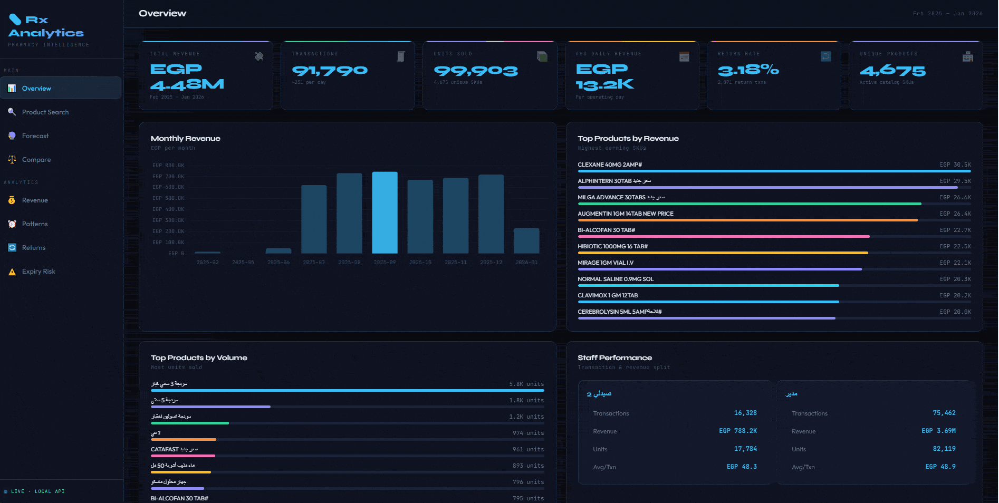

# Rx Analytics — Pharmacy Intelligence Dashboard

   




A local full-stack analytics system built on real pharmacy transaction data. Flask REST API with 9 endpoints, interactive Chart.js dashboard, and a time-series forecasting engine using **Holt's Double Exponential Smoothing**. Powered by ~94K real transactions.

— all running on your local network with zero cloud dependency.

---

## The problem this solves

A local pharmacy in Egypt was tracking all its sales in a raw Excel file — thousands of rows with no visibility into trends, no alerts for expiring stock, and no way to plan purchasing ahead of time.

This project turns that raw data into a real-time analytics dashboard accessible from any device on the local network — PC, phone, or tablet. The owner can now see which products are selling, when demand peaks, which staff member drives the most revenue, and what is about to expire.

The forecasting model auto-tunes its parameters per product to predict demand 12 weeks ahead — with confidence intervals. Built entirely without cloud services or subscriptions.

---

## Dashboard pages

| Page | What it shows |
|------|--------------|
| Overview | KPI cards, monthly revenue, top products, staff comparison |
| Product search | Search any product, filter by date range, full profile + forecast |
| Forecast | Pick product, date range, frequency (daily / weekly / monthly), periods ahead |
| Compare | Up to 6 products side-by-side — history + forecast |
| Revenue | Weekly timeline, top 15 by revenue, revenue vs volume scatter |
| Patterns | Hourly sales, day-of-week heatmap, monthly seasonality |
| Returns | Return rate analysis, most returned products |
| Expiry risk | Products expiring soon — CRITICAL / WARNING / OK status |

---

## Forecasting model

Uses **Holt's Double Exponential Smoothing** with auto-tuned α and β parameters per product.

- Handles both level and trend components
- Grid-searches optimal α (0.1–0.9) and β (0.0–0.5) by minimizing SSE
- Provides ±1.5σ confidence intervals for all forecasts
- Works with daily, weekly, and monthly aggregations
- Supports custom date ranges per product

---

## API endpoints

```
GET /api/summary                                  Overall KPIs and staff breakdown
GET /api/search?q=BRUFEN                          Fuzzy product search
GET /api/product/{name}                           Full product profile
GET /api/forecast?product=X&freq=W&n_ahead=12     Demand forecast
GET /api/compare?products=A,B,C                   Multi-product comparison
GET /api/top?by=revenue&limit=20                  Top products
GET /api/trends                                   Time trends (hourly, daily, weekly, monthly)
GET /api/returns                                  Return rate analysis
GET /api/expiry                                   Expiry risk tracker
GET /api/products/all                             All product names for autocomplete
```

---

## Quick start

### 1. Install dependencies

```bash
pip install flask pandas numpy openpyxl
```

### 2. Generate sample data

> The real `sales.xlsx` is not included in this repo — it contains private business data.
> Run this to generate a realistic sample dataset (~12,000 rows, 20 products, 4 staff, 2 years):

```bash
python generate_sample_data.py
```

### 3. Set up the project structure

```
pharmacy-analytics/
├── app.py
├── generate_sample_data.py
├── requirements.txt
├── README.md
├── sales.xlsx                ← generated by step 2 (not committed)
└── templates/
    └── index.html
```

### 4. Run

```bash
python app.py
```

Open `http://localhost:5000` in your browser.
The app also prints your local network IP — open it from any phone or tablet on the same WiFi.

---

## Tech stack

| Layer | Tools |
|-------|-------|
| Backend | Python 3, Flask |
| Data processing | Pandas, NumPy |
| Forecasting | Custom Holt's Smoothing (no external ML library) |
| Frontend | Vanilla JS, Chart.js 4 |
| Data source | Excel (.xlsx) via openpyxl |

---

## Data privacy

The real transaction data is **not included** in this repository. The `generate_sample_data.py` script produces a structurally identical dataset with synthetic values for demo and reproducibility purposes.

---

## License

MIT — free to use, modify, and distribute with attribution.
